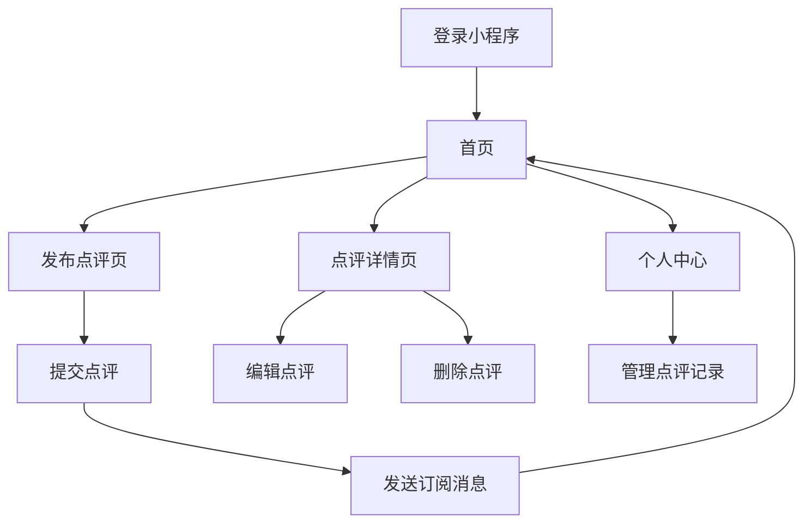

# 美食点评微信小程序产品需求文档

## 1. 产品概览
美食点评微信小程序是一款专为用户记录和管理美食体验的工具，用户可以通过小程序记录每次用餐的店铺信息、评价内容、评分等，方便用户回顾和分享自己的美食体验。

该产品旨在帮助用户更好地管理个人美食记录，通过评分排序和地区分类，让用户能够快速找到优质餐厅，同时通过微信订阅消息提醒，确保用户不会忘记记录重要的美食体验。

## 2. 核心功能

### 2.1 用户角色
| 角色 | 注册方式 | 核心权限 |
|------|----------|----------|
| 普通用户 | 微信授权登录 | 发布点评、查看点评、管理个人点评、接收订阅消息 |

### 2.2 功能模块
我们的美食点评小程序包含以下主要页面：
1. **首页**：展示用户的点评列表，支持按评分排序和地区筛选
2. **发布点评页**：用于填写新的店铺评价信息
3. **点评详情页**：查看单条点评的详细信息
4. **个人中心**：管理个人信息和点评记录

### 2.3 页面详情
| 页面名称 | 模块名称 | 功能描述 |
|---------|---------|----------|
| 首页 | 点评列表 | 展示用户的所有点评记录，每条记录包含店铺名称、评分、地区、简短评价等信息 |
| 首页 | 排序功能 | 支持按评分从高到低或从低到高排序点评记录 |
| 首页 | 地区筛选 | 支持按地区分类查看点评记录 |
| 首页 | 搜索功能 | 支持通过店铺名称或关键词搜索点评记录 |
| 发布点评页 | 基本信息 | 填写店铺名称、地区、用餐时间等基本信息 |
| 发布点评页 | 评分功能 | 为店铺进行1-5星评分 |
| 发布点评页 | 评价内容 | 输入详细的评价文字，支持添加图片 |
| 发布点评页 | 提交功能 | 提交点评信息并触发微信订阅消息提醒 |
| 点评详情页 | 详细信息 | 展示完整的点评内容，包括店铺信息、评分、评价文字、图片等 |
| 点评详情页 | 编辑功能 | 支持修改已发布的点评信息 |
| 点评详情页 | 删除功能 | 支持删除点评记录 |
| 个人中心 | 个人信息 | 展示用户的基本信息，如昵称、头像等 |
| 个人中心 | 点评管理 | 查看和管理个人发布的所有点评记录 |
| 个人中心 | 设置 | 管理订阅消息提醒等设置 |

## 3. 核心流程
用户使用美食点评小程序的主要流程如下：

1. **登录流程**：用户通过微信授权登录小程序
2. **发布点评流程**：用户进入发布点评页，填写店铺信息、评分和评价内容，提交后系统保存点评并发送微信订阅消息提醒
3. **查看点评流程**：用户在首页查看点评列表，可通过排序和筛选功能找到特定点评，点击进入详情页查看完整信息
4. **管理点评流程**：用户在个人中心查看所有点评记录，可进行编辑或删除操作

## 4. 用户界面设计

### 4.1 设计风格
- **主色调**：使用温暖的橙色作为主色调，象征美食和活力
- **辅助色**：使用白色和浅灰色作为背景色，营造干净整洁的界面
- **按钮风格**：圆角矩形按钮，主操作按钮使用主色调，次要操作按钮使用灰色
- **字体**：使用微信默认字体，标题使用稍大字号，正文使用适中字号
- **图标**：使用简约风格的线性图标，保持一致性

### 4.2 页面设计概览
| 页面名称 | 模块名称 | UI元素 |
|---------|---------|--------|
| 首页 | 导航栏 | 顶部固定导航栏，包含小程序名称和发布按钮 |
| 首页 | 筛选栏 | 排序选项和地区筛选下拉菜单 |
| 首页 | 点评列表 | 卡片式布局，每条点评包含店铺名称、评分星级、地区标签、简短评价和图片预览 |
| 发布点评页 | 表单布局 | 垂直排列的表单元素，包含输入框、选择器、评分组件和图片上传组件 |
| 发布点评页 | 提交按钮 | 底部固定的提交按钮，点击后显示加载状态 |
| 点评详情页 | 头部信息 | 店铺名称、评分、地区等基本信息，顶部固定 |
| 点评详情页 | 评价内容 | 详细的评价文字和图片展示 |
| 点评详情页 | 操作按钮 | 底部固定的编辑和删除按钮 |
| 个人中心 | 个人信息 | 顶部用户头像和昵称，可点击修改 |
| 个人中心 | 功能列表 | 列表形式展示各项功能入口，如我的点评、设置等 |

### 4.3 自适应
- 小程序设计遵循微信小程序的设计规范，适配不同尺寸的手机屏幕
- 针对小屏幕设备，优化布局和字体大小，确保内容清晰可读
- 图片上传功能支持压缩，确保在不同网络环境下的加载速度
- 页面加载状态和错误提示设计友好，提升用户体验